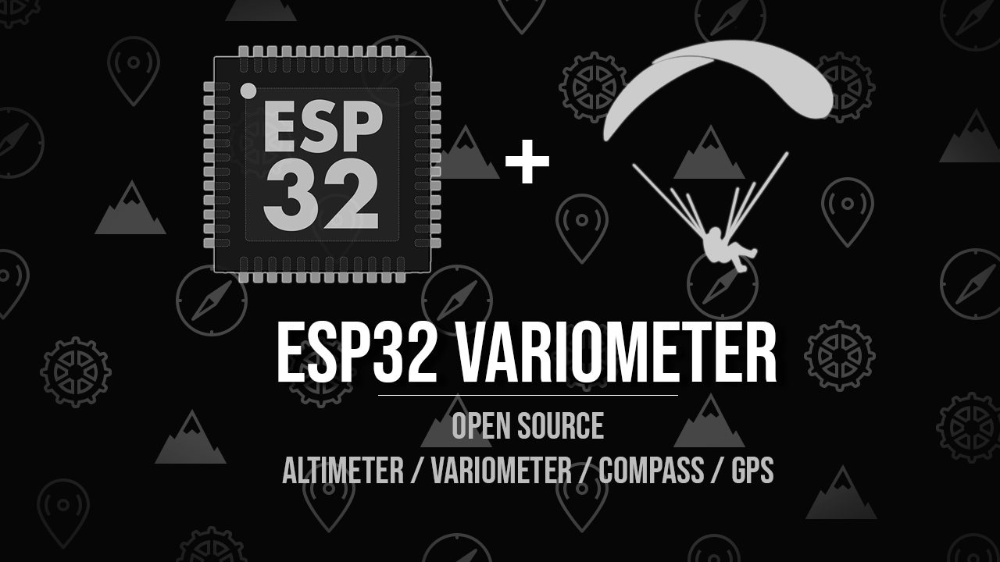

<!-- PROJECT SHIELDS -->
<!--
*** I'm using markdown "reference style" links for readability.
*** Reference links are enclosed in brackets [ ] instead of parentheses ( ).
*** See the bottom of this document for the declaration of the reference variables
*** for contributors-url, forks-url, etc. This is an optional, concise syntax you may use.
*** https://www.markdownguide.org/basic-syntax/#reference-style-links
-->
<!--[![Contributors][contributors-shield]][contributors-url]-->
[![Forks][forks-shield]][forks-url]
[![Stargazers][stars-shield]][stars-url]
[![Issues][issues-shield]][issues-url]
[![Licence][license-shield]][license-url]

<!-- PROJECT LOGO -->
 

  

  <h3 align="center"Variometer</h3>

  

   An ESP32 based variometer made for paragliding. (GPS, variometer, altimeter, compass)
     
    <a href="https://github.com/MrEliptik/variometer/wiki"><strong>Explore the docs »</strong></a>
     
     
    <a href="">View Demo</a>
    ·
    <a href="https://github.com/MrEliptik/variometer/issues">Report Bug</a>
    ·
    <a href="https://github.com/MrEliptik/variometer/issues">Request Feature</a>
  

<!-- TABLE OF CONTENTS -->
## Table of Contents

* [About the Project](#about-the-project)
  * [Built With](#built-with)
* [Getting Started](#getting-started)
  * [Prerequisites](#prerequisites)
  * [Installation](#installation)
* [Usage](#usage)
* [Roadmap](#roadmap)
* [Contributing](#contributing)
* [License](#license)
* [Contact](#contact)

<!-- ABOUT THE PROJECT -->
## About The Project

I'm starting paragliding and at some point I'll want a variometer to help me with soaring. The thing is, a commercial variometer can be very costly, and most of all, I love to make things. With this project, I want to see where I can push my embedded skills to make a full variometer with multiple modes. 

### Built With

- [Generic ESP8266 dev board]()
- [GY-68 BMP-180 pressure/temperature sensor](https://fr.aliexpress.com/item/32974445995.html?spm=a2g0s.9042311.0.0.27426c37v9jqwu)
- [GY-9250 9DOF accelerometer/gyroscope/magnetometer](https://fr.aliexpress.com/item/32657047350.html?spm=a2g0o.productlist.0.0.71877b5fs1ykll&algo_pvid=a9503d7c-d666-4761-9f6f-1a5cf54e499b&algo_expid=a9503d7c-d666-4761-9f6f-1a5cf54e499b-2&btsid=0b0a187916025200564147019ec887&ws_ab_test=searchweb0_0,searchweb201602_,searchweb201603_)
- [2.0" TFT LCD screen](https://fr.aliexpress.com/item/33012793224.html?spm=a2g0w.search0302.3.8.75f62fb68GrkRi&ws_ab_test=searchweb0_0,searchweb201602_0,searchweb201603_0,ppcSwitch_0&algo_pvid=bfeaa64b-7135-4d79-a3ac-2a1fbdff3feb&algo_expid=bfeaa64b-7135-4d79-a3ac-2a1fbdff3feb-1)
- [BEITIAN BN-280 GPS](https://fr.aliexpress.com/item/33028598418.html?spm=a2g0s.9042311.0.0.27426c37v9jqwu)
- [5 way joystick](https://fr.aliexpress.com/item/32904543849.html?spm=a2g0s.9042311.0.0.27426c37YqAQKb)

<!-- GETTING STARTED -->
## Getting Started

*TODO*

### Prerequisites

*TODO*

### Installation

*TODO*

<!-- USAGE EXAMPLES -->
## Usage

*TODO*

<!-- ROADMAP -->
## Roadmap

See the [project page](https://github.com/MrEliptik/variometer/projects).

<!-- CONTRIBUTING -->
## Contributing

Contributions are what make the open source community such an amazing place to be learn, inspire, and create. Any contributions you make are **greatly appreciated**.

1. Fork the Project
2. Create your Feature Branch (`git checkout -b feature/AmazingFeature`)
3. Commit your Changes (`git commit -m 'Add some AmazingFeature'`)
4. Push to the Branch (`git push origin feature/AmazingFeature`)
5. Open a Pull Request

<!-- LICENSE -->
## License

Distributed under the GNU Affero General Public License v3.0. See [LICENCE](LICENCE) for more information.

<!-- CONTACT -->
## Contact

Victor MEUNIER - [@VicMeunier](https://twitter.com/VicMeunier) - victormeunier.dev@gmail.com

- [Website](https://www.victormeunier.com)
- [Blog](https://blog.victormeunier.com)

You like my work and want to support me? 

<!-- MARKDOWN LINKS & IMAGES -->
<!-- https://www.markdownguide.org/basic-syntax/#reference-style-links -->
[contributors-shield]: https://img.shields.io/github/contributors/MrEliptik/variomete.svg?style=flat-square
[contributors-url]: https://github.com/MrEliptik/variometer/graphs/contributors
[forks-shield]: https://img.shields.io/github/forks/MrEliptik/variometer
[forks-url]: https://github.com/MrEliptik/variometer/network/members
[stars-shield]: https://img.shields.io/github/stars/MrEliptik/variometer
[stars-url]: https://github.com/MrEliptik/variometer/stargazers
[issues-shield]: 	https://img.shields.io/github/issues/MrEliptik/variometer
[issues-url]: https://github.com/MrEliptik/variometer/issues
[license-shield]: https://img.shields.io/github/license/MrEliptik/variometer
[license-url]: https://github.com/MrEliptik/variometer/blob/main/LICENSE
